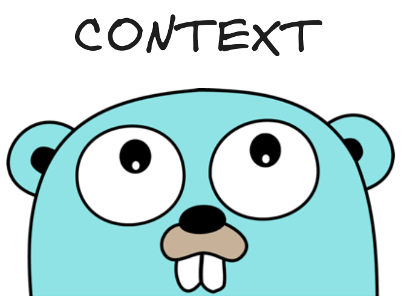

`Context` is one of the most powerful constructs in Go, and this power originates from its hierarchical nature. As you know, whenever you create a new context, you always have to pass in a parent context. For example,

```go
context.WithCancel(parent)
context.WithValue(parent, "foo", "bar")
context.WithTimeout(parent, time.Minute)
```

This means that whenever a parent context expires, either due to timeout or due to any other event, the children that inherited the parent are also canceled. However, this is **not** true the other way around, meaning that when a child context expires, the parent remains unaffected.

Example:

```go
package main

import (
	"context"
	"log"
	"sync"
)

func main() {
	ctxA, aCancel := context.WithCancel(context.Background())
	defer aCancel()

	ctxB, bCancel := context.WithCancel(ctxA)
	defer bCancel()

	ctxC, cCancel := context.WithCancel(ctxB)
	defer cCancel()

	var wg sync.WaitGroup
	wg.Add(3)

	go func() {
		<-ctxA.Done()
		log.Println("A context done")
		wg.Done()
	}()

	go func() {
		<-ctxB.Done()
		log.Println("B context done")
		wg.Done()
	}()

	go func() {
		<-ctxC.Done()
		log.Println("C context done")
		wg.Done()
	}()

	aCancel()

	wg.Wait()
}
```

In the example above, `A` is a parent to `B`, and `B` is a child to `C`, making `A` also a parent (or grandparent) to `C`.

```plaintext
A
|
|___ B
     |
     |___C
```

As a result, the cancellation of `A` also results in the cancellation of `B` and `C`.

## So, how was this useful to me?

A year ago, I was working on a project that spawned multiple goroutines, and those goroutines in turn would spawn another set of goroutines. The children goroutines were tied to their parents, and their parents were tied to their parent. Therefore, if any of the parents failed during runtime, I wanted only its children to exit without affecting other goroutines. Then, the parent would restart its children.

Using context, it was as simple as calling `cancel()` in the parent on the context passed to the children. This resulted in the cancellation of the child goroutines and their subsequent exit. After this, the concerned parent would re-spawn new children.


