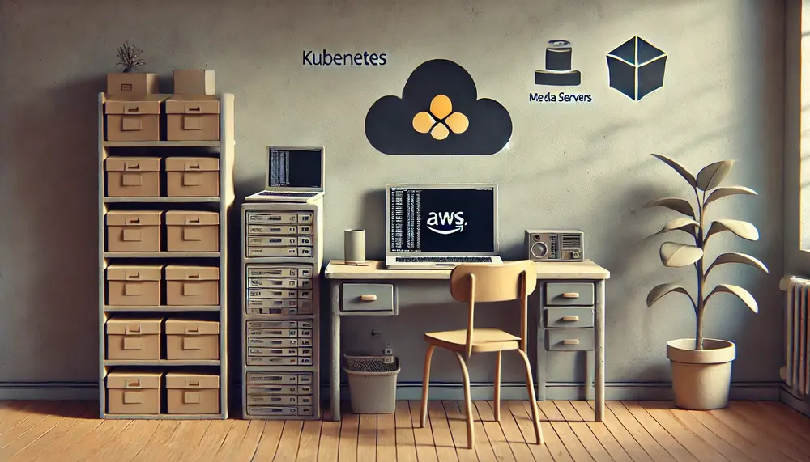
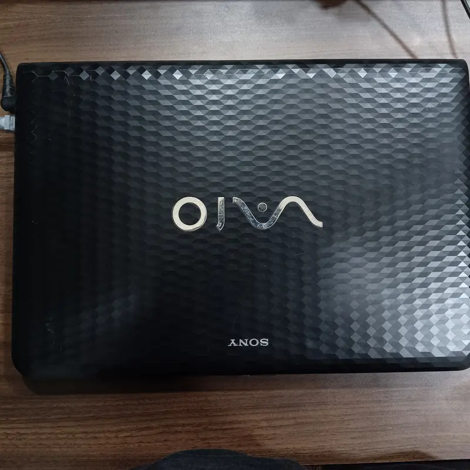

This marks the very re-beginning of my homelab journey. I don't have much to
start with - just an old, dusty laptop repurposed as a server and a VPS on AWS
cloud. (Yeah, I know using the cloud doesn't technically make it a "homelab",
but that's what I'm going with.)

> PS: This is my second attempt at building a homelab. There's nothing wrong
> with the existing one, but it's the new year time, and I wanted to start
> fresh and try something different this time.

## Provisioning an EC2 instance on AWS using Terraform

We are going to spin up a `t3.medium` EC2 instance using the latest NixOS AMI.

```hcl
terraform {
  cloud {
    organization = "murtaza-u"
    workspaces {
      name = "homelab"
    }
  }
  required_providers {
    aws = {
      source  = "hashicorp/aws"
      version = "5.81.0"
    }
  }
}

provider "aws" {
  region = "ap-south-1"
  default_tags {
    tags = {
      Name = var.srv_cloud_0.instance_name
    }
  }
}

# fetching AWS AMI image
data "aws_ami" "nixos" {
  owners      = ["427812963091"]
  most_recent = true
  filter {
    name   = "name"
    values = ["nixos/24.11*"]
  }
  filter {
    name   = "architecture"
    values = ["x86_64"] # or "arm64"
  }
}

# creating SSH key pair
resource "aws_key_pair" "key_pair" {
  key_name   = var.srv_cloud_0.instance_name
  public_key = var.srv_cloud_0.public_key
}

### security group ###
resource "aws_vpc_security_group_egress_rule" "allow_all" {
  description       = "Allow all outbound traffic"
  security_group_id = aws_security_group.srv_cloud_0.id
  ip_protocol       = "-1"
  cidr_ipv4         = "0.0.0.0/0"
}

resource "aws_vpc_security_group_ingress_rule" "allow_ssh" {
  description       = "Allow SSH inbound traffic"
  security_group_id = aws_security_group.srv_cloud_0.id
  ip_protocol       = "tcp"
  from_port         = 22
  to_port           = 22
  cidr_ipv4         = "0.0.0.0/0"
}

resource "aws_vpc_security_group_ingress_rule" "allow_http" {
  description       = "Allow http inbound traffic"
  security_group_id = aws_security_group.srv_cloud_0.id
  ip_protocol       = "tcp"
  from_port         = 80
  to_port           = 80
  cidr_ipv4         = "0.0.0.0/0"
}

resource "aws_vpc_security_group_ingress_rule" "allow_https" {
  description       = "Allow https inbound traffic"
  security_group_id = aws_security_group.srv_cloud_0.id
  ip_protocol       = "tcp"
  from_port         = 443
  to_port           = 443
  cidr_ipv4         = "0.0.0.0/0"
}

resource "aws_security_group" "srv_cloud_0" {
  name        = var.srv_cloud_0.instance_name
  description = "Firewall rules for ${var.srv_cloud_0.instance_name}"
}
### END - security group ###

# creating and associating an elastic IP
resource "aws_eip" "srv_cloud_0" {
  instance = aws_instance.srv_cloud_0.id
  domain   = "vpc"
}

# launching an EC2 instance
resource "aws_instance" "srv_cloud_0" {
  ami           = data.aws_ami.nixos.id
  instance_type = var.srv_cloud_0.instance_type
  root_block_device {
    volume_size           = var.srv_cloud_0.root_block_device.v_size
    volume_type           = var.srv_cloud_0.root_block_device.v_type
    delete_on_termination = true
  }
  associate_public_ip_address = true
  key_name                    = aws_key_pair.key_pair.key_name
  vpc_security_group_ids      = [aws_security_group.srv_cloud_0.id]
}
```

```hcl
variable "aws_region" {
  type        = string
  default     = "ap-south-1"
  description = "AWS region to deploy resources to"
}

variable "srv_cloud_0" {
  type = object({
    instance_type = string
    instance_name = string
    root_block_device = object({
      v_size = number
      v_type = string
    })
    public_key = string
  })
  description = "Configurations related to the `srv-cloud-0` EC2 instance"
}
```

```hcl
output "srv_cloud_0_eip" {
  value       = aws_eip.srv_cloud_0.public_ip
  description = "AWS elastic ip address associated with `srv-cloud-0`"
}
```

Now that that's out of the way, let's write the NixOS config for our instance.

## NixOS

I organize my configuration into reusable modules. Here is the directory
structure commonly used in the Nix community:

```
.
├── flake.lock
├── flake.nix
├── hosts
│   └── srv-cloud-0
│       └── default.nix
└── modules
    ├── default.nix
    └── platform
        ├── default.nix
        ├── nix.nix
        ├── ssh.nix
        ├── synctime.nix
        └── users.nix
```

I have extracted out pieces of code that will be reused for configuring my
second host into separate modules.

Here is how the `hosts/srv-cloud-0/default.nix` file looks like,

```nix
{ modulesPath, ... }:

{
  imports = [
    "${modulesPath}/virtualisation/amazon-image.nix"
  ];

  # Set hostname.
  networking.hostName = "srv-cloud-0";

  # Set your time zone.
  time.timeZone = "Etc/UTC";

  platform = {
    # enable flakes & configure gc
    nix.enable = true;
    # setup default users
    users.enable = true;
    # enable openssh
    ssh.enable = true;
    # enable timesyncd service
    synctime.enable = true;
  };

  # Open ports in the firewall.
  networking.firewall = {
    enable = true;
    allowedTCPPorts = [
      22 # ssh
      80 # traefik http
      443 # traefik https
    ];
    allowedUDPPorts = [ ];
  };
}
```

> You can find the source code for my homelab setup on [my
> github](https://github.com/murtaza-u/infra).

## Re-purposing an old laptop as my second host

I have an old Sony laptop lying around, collecting dust. It is probably a
decade old by now. It has a quad-core CPU, 4GB of memory, and 256GB of
storage. I’ve configured my router’s DHCP settings to always assign it the IP
address `192.168.29.05`.



I've already installed and configured NixOS on it. The configuration is very
similar to our `srv-cloud-0` host. For brevity, I’ll only mention the changed
parts.

```nix
# Setting GRUB boot loader.
boot.loader.grub.enable = true;
# Define on which hard drive you want to install Grub.
boot.loader.grub.device = "/dev/sda"; # or "nodev" for efi only

# Disable suspend.
# We are using a laptop as a server here, so we want it to keep running even
# when the lid is closed.
systemd.targets.sleep.enable = false;
services.logind.lidSwitch = "ignore";

# Set hostname.
networking.hostName = "srv-onprem-0";
```

```
├── hosts
│   ├── srv-cloud-0
│   │   └── default.nix
│   └── srv-onprem-0
│       ├── default.nix
│       └── hardware.nix
```

Since this is a bare-metal host, the configuration also include the hardware
configuration (`hosts/srv-onprem-0/hardware.nix`). This is automatically
generated by `nixos-generate-config` during the installation.

Lastly, here is the `nixosConfiguration` block in `flake.nix` that brings
everything together,

```nix
nixosConfigurations = {
  srv-cloud-0 = nixpkgs.lib.nixosSystem {
    system = "x86_64-linux";
    modules = [
      {
        nix.registry.nixpkgs.flake = nixpkgs;
        system.stateVersion = "24.11";
      }
      ./modules
      ./hosts/srv-cloud-0
    ];
  };
  srv-onprem-0 = nixpkgs.lib.nixosSystem {
    system = "x86_64-linux";
    modules = [
      {
        nix.registry.nixpkgs.flake = nixpkgs;
        system.stateVersion = "24.11";
      }
      ./modules
      ./hosts/srv-onprem-0
    ];
  };
};
```

To update my hosts with the new configuration changes, I can run:

```sh
nixos-rebuild --flake .#srv-onprem-0 --target-host srv-onprem-0 --use-remote-sudo switch
nixos-rebuild --flake .#srv-cloud-0 --target-host srv-cloud-0 --use-remote-sudo switch
```

Where, `srv-onprem-0` & `srv-cloud-0` point to hosts in my ssh config,

```sh
Host srv-cloud-0
    User murtaza
    Hostname <ip>
    IdentityFile ~/.ssh/homelab

Host srv-onprem-0
    User murtaza
    Hostname 192.168.29.05
    IdentityFile ~/.ssh/homelab
```
