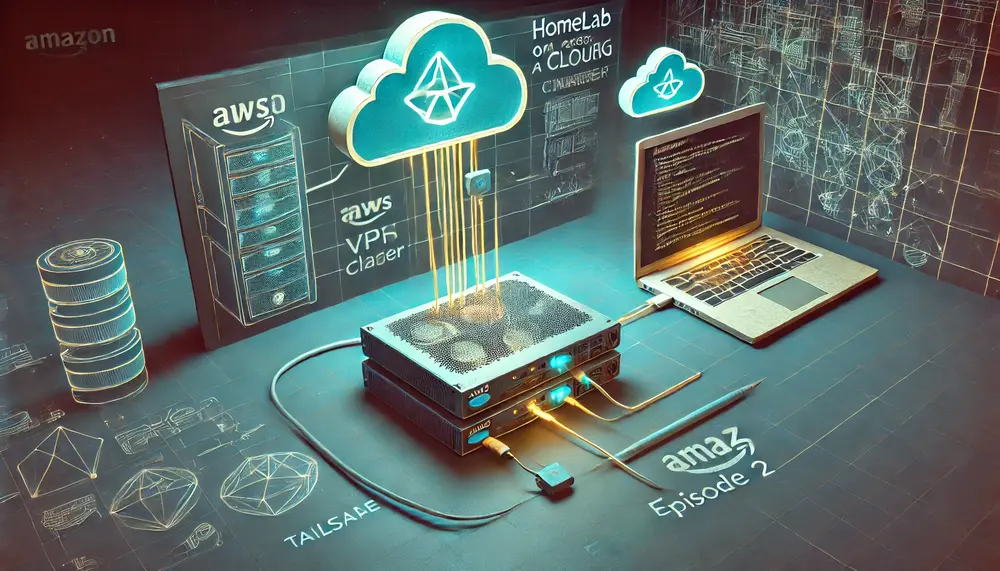
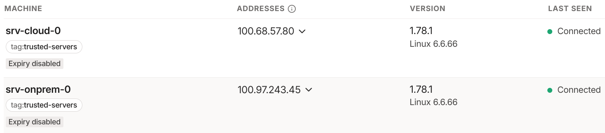

My first goal is to enable `srv-cloud-0` (EC2 instance) and `srv-onprem-0` (laptop repurposed as a server) to talk with each other. However, since `srv-onprem-0` lives within my home network, `srv-cloud-0` cannot directly reach it. The solution to this is obviously to set up a VPN on `srv-cloud-0` and connect the two through a VPN tunnel.

However, I am too lazy to set that up, which is where [Tailscale](https://tailscale.com) comes in.

> An alternative to a VPN would be setting up port forwarding on my router, but I absolutely do NOT want to do that. Moreover, my [Jio](https://www.jio.com/) router doesn't even support port forwarding.

## Tailscale

Tailscale is an almost zero-configuration mesh VPN services that uses the Wiregaurd protocol. It provides all the good stuff of a VPN, but in contrast to a traditional VPN, uses a mesh network. This means that every device in the virtual Tailscale network (`tailnet`) is connected to every other device. It also supports routing traffic through an exit node like a traditional VPN.

Setting it up is surprisingly simple.

By default, Tailscale allows all devices in the `tailnet` to communicate with one another. I've modified the default policy to restrict communication to devices tagged as `trusted-servers`.

```json
{
	// Define the tags which can be applied to devices and by which users.
	"tagOwners": {
		"tag:trusted-servers": ["autogroup:owner"],
	},

	// Define access control lists for users, groups, autogroups, tags,
	// Tailscale IP addresses, and subnet ranges.
	"acls": [
		{
			"action": "accept",
			"src":    ["tag:trusted-servers"],
			"dst":    ["tag:trusted-servers:*"],
		},
	],
}
```

To register a new device with Tailscale, we need to create an auth key. Auth keys can have one or more tags attached to them. When a device uses an auth key to register with Tailscale, the tags attached to the key are automatically assigned to the device.

Each tag has an owner, and only the owners of the defined tags can attach them to auth keys they create.

In the policy above, I’ve created a tag `trusted-user`, owned by the users in the group `owner` (which is me). This tag will be assigned to both my nodes.

Additionally, in the `acls` block below, I've defined a rule that allows a device with the tag `trusted-user` to communicate with another device with the same tag on any port. I’ll probably tighten this even further later.

## Installing Tailscale client on our NixOS hosts

Let's write a small NixOS helper module to set up the Tailscale client.

```nix
{ lib, config, ... }:

{
  options = {
    platform.tailscale = {
      enable = lib.mkEnableOption "Enable tailscale client daemon";
      authKeyFile = lib.mkOption {
        type = lib.types.str;
        description = "Tailscale auth key file path";
        example = lib.literalExpression "/run/secrets/tailscale/auth_key";
      };
    };
  };
  config = lib.mkIf config.platform.tailscale.enable {
    services.tailscale = {
      enable = true;
      disableTaildrop = true;
      authKeyFile = config.platform.tailscale.authKeyFile;
    };
  };
}
```

The module above accepts the path to the Tailscale auth key file. This auth key file is encrypted using SOPS and checked into Git. I use sops-nix to decrypt the secret on the host and store it under `/run/secrets`. There are many great things about SOPS, such as how it lets you version control yours secrets and how well the secrets file plays git diffs, but I’ll let you explore it on your own.

```nix
sops = {
  defaultSopsFile = ../../secrets.yaml;
  validateSopsFiles = false;
  age.sshKeyPaths = [ "/home/${config.users.users.scout.name}/.ssh/id_ed25519" ];
  secrets."tailscale/auth_keys/srv_cloud_0" = {
    mode = "0400";
    owner = "root";
  };
};

platform.tailscale = {
  enable = true;
  authKeyFile = config.sops.secrets."tailscale/auth_keys/srv_cloud_0".path;
};
```

One last detail: SOPS uses [Age](https://github.com/FiloSottile/age) to encrypt your secrets. Age can generate a cryptographic key pair from your SSH keys. So, all I had to do was copy the SSH private key (used for decrypting secrets) to the hosts, specify the file path in my Nix config, and sops-nix would take care of the rest.



## Building a k3s cluster

| Server | Role (k3s terminology) | Description | |--------------|------------------------|-----------------------------| | srv-cloud-0 | server + agent | Control-plane + worker node | | srv-onprem-0 | agent | Worker only |

```nix
###################
### srv-cloud-0 ###
###################
services.k3s = {
  enable = true;
  serverAddr = "https://srv-cloud-0:6443";
  gracefulNodeShutdown = {
    enable = true;
    shutdownGracePeriod = "1m30s";
    shutdownGracePeriodCriticalPods = "2m";
  };
  role = "server";
  extraFlags = ''
    --tls-san srv-cloud-0 \
    --secrets-encryption \
    --node-ip 100.68.57.80
  '';
};
```

We can verify that k3s is up and running:

```text
nix shell nixpkgs#kubectl
sudo kubectl --kubeconfig /etc/rancher/k3s/k3s.yaml get node

NAME           STATUS   ROLES                  AGE   VERSION
srv-cloud-0    Ready    control-plane,master   2m    v1.31.1+k3s1
```

**Setting up K3s on `srv-onprem-0`**:

In order for Kubernetes to admit a node to the cluster, we need to provide it with a token which can be fetched from the `srv-cloud-0` node at `/var/lib/rancher/k3s/server/node-token`.

```nix
####################
### srv-onprem-0 ###
####################
sops = {
  defaultSopsFile = ../../secrets.yaml;
  validateSopsFiles = false;
  age.sshKeyPaths = [ "/home/${config.users.users.scout.name}/.ssh/id_ed25519" ];
  secrets = {
    "tailscale/auth_keys/srv_onprem_0" = {
      mode = "0400";
      owner = "root";
    };
    # retrieved from srv-cloud-0:`/var/lib/rancher/k3s/server/node-token` and
    # saved in `secrets.yaml`
    "k3s_token" = {
      mode = "0400";
      owner = "root";
    };
  };
};

services.k3s = {
  enable = true;
  serverAddr = "https://srv-cloud-0:6443";
  gracefulNodeShutdown = {
    enable = true;
    shutdownGracePeriod = "1m30s";
  };
  role = "agent";
  tokenFile = config.sops.secrets."k3s_token".path;
  extraFlags = ''
    --node-ip 100.97.243.45
  '';
};
```

`100.68.57.80` and `100.97.243.45` are the internal IPv4 addresses of the nodes within `tailnet`. Kubernetes will set these IPs as the nodes' internal IPs.

```plaintext
kubectl get node -o wide
NAME           STATUS   ROLES                  INTERNAL-IP     EXTERNAL-IP
srv-cloud-0    Ready    control-plane,master   100.68.57.80    <none>
srv-onprem-0   Ready    <none>                 100.97.243.45   <none>
```
