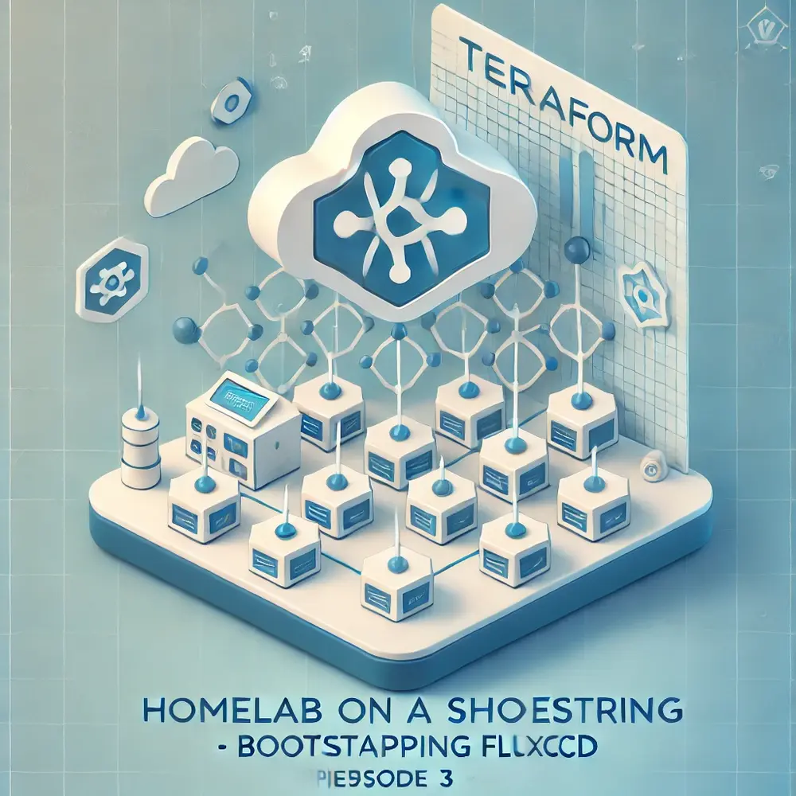

## Tainting `srv-onprem-0`

Before we move to bootstrapping Flux, there is one important thing I need to
do. You see, node `srv-onprem-0` is not guaranteed to be available all the
time, as I may turn it off every now and then. Moreover, `srv-onprem-0` is
primarily for hosting Pi-hole and my media server, and I do not really want
any workloads to run on it unless I explicitly specify so. Adding taints to
the node will guarantee that no workloads will execute on it unless I
explicitly define toleration against the taint.

Let's start with adding a couple of important labels to our nodes.

```text
kubectl label node srv-cloud-0 availability=high type=cloud
kubectl label node srv-onprem-0 availability=low type=onprem
kubectl get nodes -L availability,type
NAME           STATUS   ROLES                  AVAILABILITY   TYPE
srv-cloud-0    Ready    control-plane,master   high           cloud
srv-onprem-0   Ready    <none>                 low            onprem
```

Finally, let's taint `srv-onprem-0`:

```text
kubectl taint node srv-onprem-0 availability=low:NoExecute
```

Let's verify that no pods are running on `srv-onprem-0`:

```text
kubectl get pod -A -o wide
NAMESPACE     NAME                                      STATUS      NODE
kube-system   coredns-56f6fc8fd7-jkwm6                  Running     srv-cloud-0
kube-system   helm-install-traefik-crd-c56vg            Completed   srv-cloud-0
kube-system   helm-install-traefik-pwm7d                Completed   srv-cloud-0
kube-system   local-path-provisioner-846b9dcb6c-9p9b4   Running     srv-cloud-0
kube-system   metrics-server-5985cbc9d7-7s965           Running     srv-cloud-0
kube-system   svclb-traefik-e502d4e1-mvkcs              Running     srv-cloud-0
kube-system   traefik-8dc7cf49b-cqq7j                   Running     srv-cloud-0
```

And that is indeed the case!

## Bootstrapping FluxCD using Terraform

FluxCD is a gitops tool. You commit changes to a git repository and Flux takes
care of syncing them to your cluster. Your git repository becomes the source
of truth for your infrastructure.

Flux provides a straightforward Terraform module to bootstrap itself, which I
have customized to suit my infrastructure.

```hcl
terraform {
  cloud {
    organization = "murtaza-u"
    workspaces {
      name = "homelab-kubernetes"
    }
  }
  required_providers {
    GitHub = {
      source  = "integrations/github"
      version = "6.4.0"
    }
    flux = {
      source  = "fluxcd/flux"
      version = "1.4.0"
    }
  }
}

provider "github" {
  owner = var.github_owner
  token = var.github_token
}

provider "flux" {
  kubernetes = {
    config_paths = [
      "~/.kube/config",
      "kubeconfig"
    ]
  }
  git = {
    url = "https://github.com/${var.github_owner}/${var.github_repository}"
    http = {
      username = "git"
      password = var.github_token
    }
    author_email = "bot@fluxcd.io"
    author_name  = "Flux Bot"
    branch       = "main"
  }
}

resource "github_repository" "this" {
  name                 = var.github_repository
  description          = "Homelab on a Shoestring"
  visibility           = "public"
  has_issues           = true
  has_discussions      = true
  has_projects         = false
  has_wiki             = false
  vulnerability_alerts = true
  auto_init            = true
}

resource "flux_bootstrap_git" "this" {
  depends_on = [github_repository.this]
  components_extra = [
    "image-reflector-controller",
    "image-automation-controller"
  ]
  # flux manifests will be extracted from the provider binary instead of being
  # downloaded from GitHub.
  embedded_manifests = true
  # interval at which to reconcile from bootstrap repository.
  interval = "1m0s"
  # keep the namespace after uninstalling Flux components.
  keep_namespace = false
  namespace      = "flux-system"
  path           = "clusters/homelab"
}

#################
### variables ###
#################
variable "github_owner" {
  description = "GitHub owner/organisation name"
  type        = string
  default     = "murtaza-u"
}

variable "github_repository" {
  description = "GitHub repository name"
  type        = string
}

variable "github_token" {
  description = "GitHub token"
  type        = string
  sensitive   = true
}
```

The `github_token` referenced in the Terraform code above is a fine-grained
GitHub token with read-write access to the administration and content of my
[infra](https://github.com/murtaza-u/infra) repository. As mentioned in the
previous episode, all my secrets, including this one, are encrypted using SOPS
and committed to git.

There is one problem, though. If I run terraform apply now, Terraform will
attempt to create the GitHub repository and throw an error saying that the
repository already exists. This happens because Terraform does not have the
state of my GitHub repository. To feed it with the state, I ran:

```text
terraform import github_repository.this infra
```

After this, when I ran `terraform apply`, Terraform used the existing GitHub
repository and my `kubeconfig` file to bootstrap FluxCD.

```text
commit 183044d9e000501425f8a16838b975d38b81364a
Author: Flux Bot <bot@fluxcd.io>
Date:   Mon Dec 23 14:54:17 2024 +0530

    Add Flux sync manifests

commit 89472d735ee71e78bc9abed171885d5bb5bc29a7
Author: Flux Bot <bot@fluxcd.io>
Date:   Mon Dec 23 14:54:06 2024 +0530

    Add Flux v2.4.0 component manifests
```

The above two commits were added by FluxCD to my GitHub repository during the
boostrap.

## Repository Structure

After setting up Flux, I installed several things on my cluster, including
Prometheus, Grafana, Loki, AlertManager, and cert-manager. I follow
[FluxCD's recommended approach](https://fluxcd.io/flux/guides/repository-structure/)
to structure my repository. It is so well thought out, I'm a sucker for
well-thought opinions.

```
.
├── apps
│   ├── base
│   │   └── ntfy
│   │       ├── kustomization.yaml
│   │       ├── service.yaml
│   │       └── statefulset.yaml
│   └── homelab
│       └── ntfy
│           ├── ingress.yaml
│           ├── kustomization.yaml
│           ├── namespace.yaml
│           ├── server.yml
│           └── servicemonitor.yaml
├── clusters
│   └── homelab
│       ├── apps.yaml
│       ├── flux-system
│       │   ├── gotk-components.yaml
│       │   ├── gotk-sync.yaml
│       │   └── kustomization.yaml
│       ├── infrastructure.yaml
│       └── local-path-storage-class.yaml
├── flake.lock
├── flake.nix
├── hosts
│   ├── srv-cloud-0
│   │   └── default.nix
│   └── srv-onprem-0
│       ├── default.nix
│       └── hardware.nix
├── infrastructure
│   └── homelab
│       ├── cert-manager
│       │   ├── cert-manager.yaml
│       │   ├── controller
│       │   │   ├── kustomization.yaml
│       │   │   ├── release.yaml
│       │   │   └── repository.yaml
│       │   ├── issuers
│       │   │   ├── kustomization.yaml
│       │   │   ├── letsencrypt-prod.yaml
│       │   │   └── letsencrypt-staging.yaml
│       │   ├── kustomization.yaml
│       │   └── namespace.yaml
│       ├── monitoring
│       │   ├── alertfy
│       │   │   ├── kustomization.yaml
│       │   │   ├── release.yaml
│       │   │   ├── repository.yaml
│       │   │   └── sealed-secret.yaml
│       │   ├── kube-prometheus-stack
│       │   │   ├── kustomization.yaml
│       │   │   ├── release.yaml
│       │   │   └── repository.yaml
│       │   ├── kustomization.yaml
│       │   ├── loki
│       │   │   ├── kustomization.yaml
│       │   │   ├── loki.yaml
│       │   │   ├── promtail.yaml
│       │   │   └── repository.yaml
│       │   └── namespace.yaml
│       └── sealed-secrets
│           ├── kustomization.yaml
│           ├── namespace.yaml
│           ├── release.yaml
│           └── repository.yaml
├── LICENSE
├── modules
│   ├── default.nix
│   └── platform
│       ├── default.nix
│       ├── nix.nix
│       ├── ssh.nix
│       ├── synctime.nix
│       ├── tailscale.nix
│       └── users.nix
├── provision
│   ├── aws
│   │   ├── main.tf
│   │   ├── output.tf
│   │   ├── terraform.tfvars
│   │   └── variables.tf
│   └── flux
│       ├── main.tf
│       ├── terraform.tfvars
│       └── variables.tf
├── README.md
└── secrets.yaml

27 directories, 62 files
```

## What's Next?

I’m not sure, but as my homelab evolves, I'll keep writing about whatever I
find interesting. If you find something useful in my homelab, feel free to
copy it from my [GitHub `infra` repository](https://github.com/murtaza-u/infra).

Before signing off, if you run a homelab too, I'd love to connect with you.
You can find my social media handles [here](https://murtazau.xyz). Feel free
to drop me a DM.
