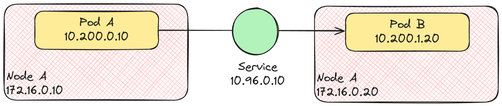
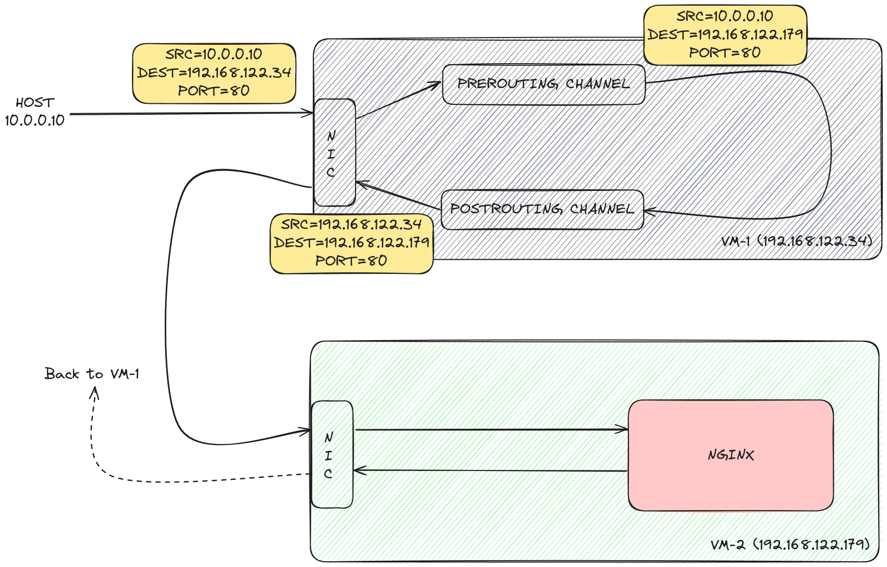

## Background

- Whenever you create pods, Kubernetes assigns each pod an IP address from the pod CIDR. These IP addresses are ephemeral and can change when a pod is deleted or replaced by a new one.
- To solve this problem, Kubernetes lets you create a Service. Each Service is assigned a persistent IP address, from the service CIDR. A Service keeps track of the pod IP addresses (using an EndpointSlice) that match its label selector.
- Other pods in the cluster, regardless of what node they are on, can communicate with our pods using the Service IP.
- It is said that the Service distributes traffic across your pods. But does it really do that?

## Diving deeper

In reality, it's the `Kube-Proxy` that's responsible for distributing traffic across our pods. `Kube-Proxy` is a daemon running on every worker node, listening for changes to the Service and EndpointSlice objects via the `kube-apiserver`.



That's all well and good, but it still doesn't answer our question: *When I make a call to a service IP, how does the network packet route from my pod container to the pod running on a different node?*

## Meet `iptables`

`Iptables` is a utility program that allows us (or any userspace program) to configure the IP packet rules of the Linux kernel firewall. Using `iptables`, we can configure routing rules for our network packets.

Let's take a simple example to understand `iptables`. I have two Debian virtual machines running - `vm-1` and `vm-2`

```plaintext
$ sudo virsh net-dhcp-leases default

 Expiry Time           MAC address         Protocol   IP address           Hostname   Client ID or DUID
------------------------------------------------------------------------------------------------------------------------------------------------
 2024-06-12 21:12:46   52:54:00:14:61:98   ipv4       192.168.122.179/24   vm-2       ff:00:14:61:98:00:01:00:01:2d:f8:ab:17:52:54:00:ef:6c:aa
 2024-06-12 21:18:12   52:54:00:a1:ec:9d   ipv4       192.168.122.34/24    vm-1       ff:00:a1:ec:9d:00:01:00:01:2d:f8:ab:17:52:54:00:ef:6c:aa
```

- `vm-1`(192.168.122.34) has iptables installed.
- `vm-2`(192.168.122.179) has nginx web server installed and is serving a static web page on port 80.

We can access the webpage on `vm-2` from our host:

```plaintext
murtaza@host:~$ curl -s http://192.168.122.179 # vm-2 IP
<!DOCTYPE html>
<html lang="en">
<head>
    <meta charset="UTF-8">
    <meta http-equiv="X-UA-Compatible" content="IE=edge">
    <meta name="viewport" content="width=device-width, initial-scale=1.0">
    <title>VM-2</title>
</head>
<body>
    <h1>Serving from VM-2</h1>
</body>
</html>
```

Instead of accessing the page from `vm-2` directly, our goal is to access it through `vm-1`, like so:

```sh
curl -s http://192.168.122.34 # vm-1 IP
```

We'll use `iptables` to route the incoming traffic on `vm-1` to `vm-2`.

```sh
murtaza@vm-1:~$ sudo iptables \
	--table nat \
	--append PREROUTING \
	--protocol tcp \
	--destination 192.168.122.34 \
	--dport 80 \
	--jump DNAT \
	--to-destination 192.168.122.179:80

murtaza@vm-1:~$ sudo iptables \
	--table nat \
	--append POSTROUTING \
	--protocol tcp \
	--destination 192.168.122.179 \
	--dport 80 \
	--jump SNAT \
	--to-source 192.168.122.34
```

To list the 2 rules we just created, run:

```sh
murtaza@vm-1:~$ sudo iptables --table nat --list
```



By default, Linux won't allow you to forward IP packets from `vm-1` to `vm-2`. To enable it, run the following on `vm-1`:

```sh
murtaza@vm-1:~$ sudo sysctl -w net.ipv4.ip_forward=1
```

```plaintext
murtaza@host:~$ curl http://192.168.122.34/ # vm-1 IP
<!DOCTYPE html>
<html lang="en">
<head>
    <meta charset="UTF-8">
    <meta http-equiv="X-UA-Compatible" content="IE=edge">
    <meta name="viewport" content="width=device-width, initial-scale=1.0">
    <title>VM-2</title>
</head>
<body>
    <h1>Serving from VM-2</h1>
</body>
</html>
```

**And it works! 🎉**

`iptables` can do much more than what we demonstrated. However, the example above will help you understand better how `kube-proxy` might be utilizing `iptables` under the hood to proxy requests to pods running on different nodes. Keep in mind that Kubernetes networking is much more complicated than this. This article was meant to just get your feet wet and give you a superficial idea.

## Further Details

Kubernetes also utilizes CNI (Container Network Interface) plugins that make it possible for the node to determine to which pod the packet needs to be forwarded when a packet arrives on its interface. An example of a popular CNI plugin is [Flannel](https://github.com/flannel-io/flannel), which uses the VXLAN protocol to wrap the Ethernet frame inside a UDP packet before forwarding it to the destined pod's node.

If what I just said sounds complicated, don't worry. This was just meant to explain to you how complicated Kubernetes networking is. To learn more, I highly recommend watching this [talk by Jeff Poole](https://www.youtube.com/watch?v=InZVNuKY5GY).
