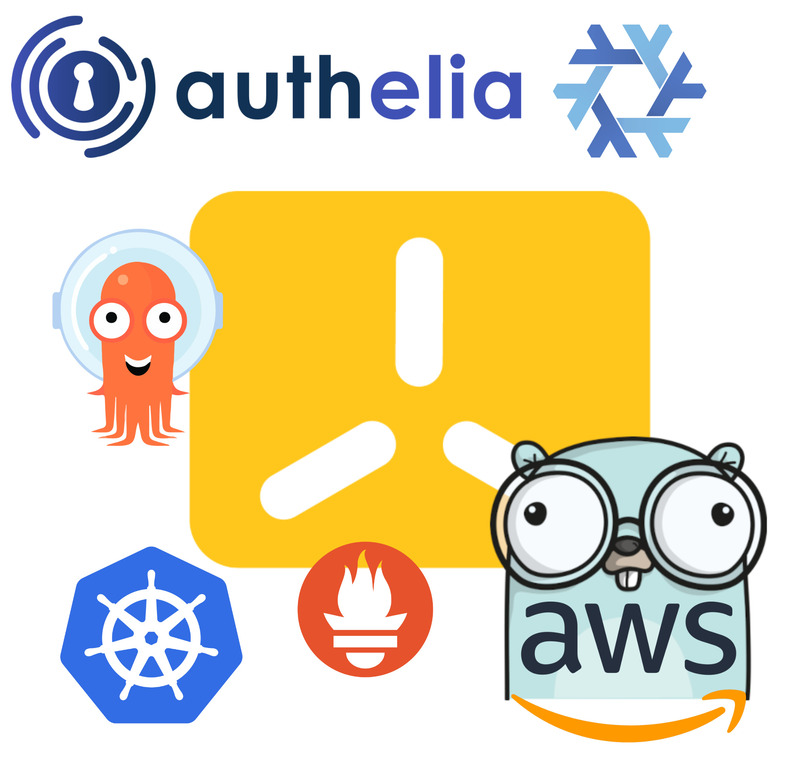
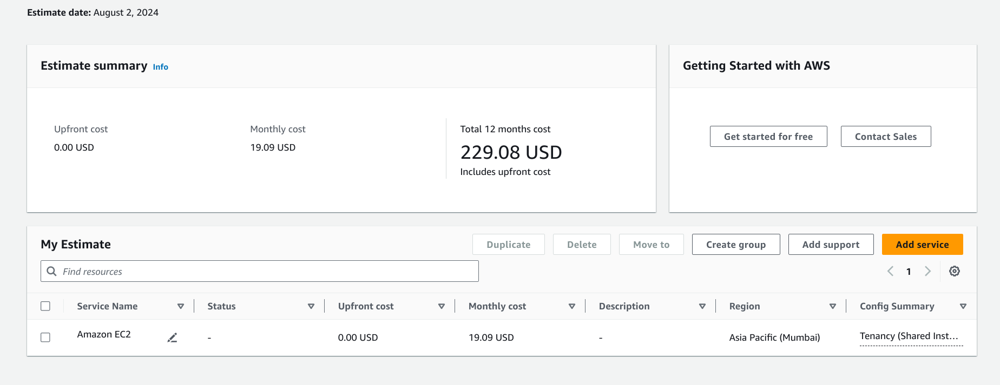

## Backstory

I've been running an AWS EC2 t2.micro instance for over a year now. It started with a few Docker containers behind an NGINX reverse proxy, with Docker Compose files scattered all over the file system.

> **PS:** Recently, I finally took out the time to organize everything into an Ansible playbook.

The t2.micro instance, although it has crashed multiple times due to memory exhaustion, has served me well for what it was intended for — an _experimentation playground_. I have hosted several of my personal projects, as well as a couple of [community](https://awesome-selfhosted.net) projects, over the year. I never intended to put anything in production on the instance, nor do I plan to in my upcoming lab. Everything hosted on these instances is for my (and my friends') personal use. After all, there's a reason I call it a "lab".

## Time for an Upgrade

For my plans, an instance with 4 GB of memory and 2 CPUs should be sufficient (hopefully). I've decided to upgrade to a t4g.medium instance. The AWS cost calculator estimates the monthly bill with 100% usage and 30 GB of EBS (gp3) volume to be around 19 USD (~1600 INR), excluding taxes.

I could reduce the price to around 14 USD/month by opting for the EC2 savings plan and reserving the instance for 1 year. However, since I'm unsure if the current specs will suffice for my computing needs, I've decided to stick to the on-demand plan.

## Deciding the AMI to Use for the Instance

> tl;dr: NixOS

I've been using [NixOS](https://nixos.org) on my laptop for 6 months now. NixOS lets me declare everything about my computer in code. Among other things, it allows rolling back to the previous configuration if something breaks. NixOS has proven to be very stable for me. NixOS is built on top of Nix, which achieves true IaaC by being reproducible and declarative. If Nix didn't exist, I would likely use a Debian AMI and [Ansible](https://ansible.com) to provision stuff on top of it.

That being said, I have never used NixOS on a server before and am much more comfortable with Ansible in that regard. Using Ansible, I can write a GitHub action to automatically re-provision the server (by re-running the playbook). I expect something similar from Nix.

## My Plans for the New Lab

I want to run Kubernetes. Why, you may ask? Because it is fun. In all honesty, my previous stack consisting of Ansible and Docker would be better suited since my workloads are few in number and in no way require the complexity of Kubernetes. But again, the entire point of having a homelab is to experiment and have fun! The cluster would also not be highly available since I only have a single node. Also, I do not plan to run vanilla Kubernetes, but a lightweight distribution of it called "[K3S](https://k3s.io)".

> K3S reminds me of [Busybox](https://busybox.net) where all binaries on the system are just hard links to a single executable. K3S is a monolithic binary that contains all the Kubernetes components minimized into itself, including the container runtime. The components are stripped down, so the binary is under 100MB and is very easy to install. A K3S installation on a Debian VM runs under 700 MB with no workloads deployed.

I intend to set up my lab as "enterprise-y" as possible. I want to follow the principles of GitOps and IaaC, and set up monitoring and observability using [Prometheus](https://prometheus.io), and perhaps install a service mesh like [Istio](https://istio.io). Here is a list of things I want to set up in the coming week on my single-node K3S cluster:

- [ArgoCD](https://argo-cd.readthedocs.io/en/stable/)
- Prometheus and [Grafana](https://grafana.com)
- [Authelia](https://www.authelia.com) as an IdP for Kubernetes and other services
- [Synapse](https://element-hq.github.io/synapse/latest/) (Matrix server)
- Minecraft server
- Migrate my projects from the old server to the new one
