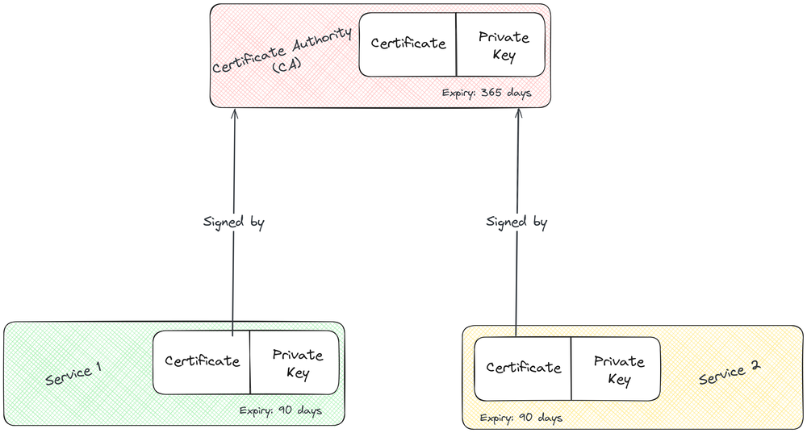

## Certificate Authority (CA)

The CA serves as the root authority. All certificates generated for different services will be signed by it. Let's create our CA first.

```plaintext
mkdir ca

openssl req \
    -x509 \
    -newkey rsa:4096 \
    -days 365 \
    -nodes \
    -keyout ca/key.pem \
    -out ca/cert.pem
```

Now, let's dissect the command above:

- `req`: Used to generate a certificate signing request (CSR).
- `-x509`: Tells OpenSSL to generate a certificate directly instead of a CSR.
- `-newkey rsa:4096`: Generates a new RSA key pair with a key length of 4096 bits.
- `-days 365`: Expires the certificate after 365 days.
- `-nodes`: Stands for no DES (Data Encryption Standard), tells OpenSSL not to encrypt the private key. By default, OpenSSL encrypts the private key with a passphrase.
- `-keyout`: Specifies the destination of the private key file.
- `-out`: Specifies the destination of the certificate file.

You'll be prompted to fill out a few options. Enter '.' to leave the field blank. Typically, I fill out the organization name (O), common name (CN), and email address.

```plaintext
-----
You are about to be asked to enter information that will be incorporated
into your certificate request.
What you are about to enter is what is called a Distinguished Name or a DN.
There are quite a few fields but you can leave some blank.
For some fields, there will be a default value.
If you enter '.', the field will be left blank.
-----
Country Name (2 letter code) [AU]:.
State or Province Name (full name) [Some-State]:.
Locality Name (eg, city) []:.
Organization Name (eg, company) [Internet Widgits Pty Ltd]: Murtaza Udaipurwala
Organizational Unit Name (eg, section) []:.
Common Name (e.g. server FQDN or YOUR name) []: murtazau.xyz
Email Address []: murtaza@murtazau.xyz
```

Our CA is now ready.

```plaintext
.
└── ca
    ├── cert.pem
    └── key.pem
```

To analyze our CA certificate (or any future certificate) run,

```plaintext
openssl x509 -in ca/cert.pem -noout -text
```

## Generating certificate for service 1

To generate a signed certificate, we need to first generate a private key and a CSR (Certificate Signing Request). **Hint**: We omit the `-x509` option.

```plaintext
mkdir service1

openssl req \
    -newkey rsa:4096 \
    -nodes \
    -keyout service1/key.pem \
    -out service1/req.pem \
    -subj "/O=Murtaza Udaipurwala/CN=service1.murtazau.xyz/emailAddress=murtaza@murtazau.xyz"
```

The above command is similar to the one we used to generate the CA, except that we are not generating the certificate directly (by omitting the `-x509` option). This command creates a private key (`service1/key.pem`) and a CSR (`service1/req.pem`). We also don't need to specify the expiry (`-days`) because expiry is a parameter of the certificate and not the CSR.

This time instead of filling out the options, like we did for the CA, we've specified the organization (O), common name (CN), and the email address using the `-subj` flag. You can omit the `-subj` flag if you prefer an interactive dialog instead.

Next, let's generate a certificate for service1 using the CSR (`service1/req.pem`). We'll use the CA's certificate and private key to sign this certificate.

```plaintext
openssl x509 \
    -req -in service1/req.pem \
    -days 90 \
    -CA ca/cert.pem \
    -CAkey ca/key.pem \
    -out service1/cert.pem
```

Let's dissect this command:

- `x509`: Tells OpenSSL that we want to generate an X.509 certificate.
- `-req -in`: Specifies that the input file is a CSR (`service1/req.pem`).
- `-days 90`: Expires the certificate after 90 days.
- `-CA`: Path to CA's certificate.
- `-CAkey`: Path to CA's private key.
- `-out`: Specifies the destination of the certificate file.

Our self-signed certificate for Service 1 is now ready.

```plaintext
.
├── ca
│   ├── cert.pem
│   └── key.pem
└── service1
    ├── key.pem
    ├── cert.pem
    └── req.pem
```

> For practice, try generating a certificate for service 2

## Renewing CA's certificate

Our CA's certificate will expire after 365 days. In order to renew it, we need to create a new CSR and generate a new certificate.

```plaintext
openssl req \
    -new \
    -key ca/key.pem \
    -out ca/req.pem \
    -subj "/O=Murtaza Udaipurwala/CN=murtazau.xyz/emailAddress=murtaza@murtazau.xyz"
```

Let's break down the above command:

- `req -new`: Implies that we are generating a new CSR.
- `-key`: Path to the private key file.
- `-out`: Specifies the destination of the CSR file (`ca/req.pem`).
- `-subj`: Used to attach metadata to the CSR.

The command generates a new CSR at `ca/req.pem`.

Now let's use this CSR to generate a new certificate for our CA.

```plaintext
openssl x509 \
    -req -in ca/req.pem \
    -days 365 \
    -CA ca/cert.pem \
    -CAkey ca/key.pem \
    -out ca/new_cert.pem
```

This command should look similar to the one we studied in the previous section. We are using the old CA certificate to generate a new one. Finally, replace `ca/cert.pem` with `ca/new_cert.pem`.

## Renewing service 1's certificate

Renewing an expired certificate for your services is exactly similar to renewing the CA's certificate. We create a new CSR and use it to generate a new self-signed certificate. Below is the command to do so:

```plaintext
openssl req \
    -new \
    -key service1/key.pem \
    -out service1/req.pem \
    -subj "/O=Murtaza Udaipurwala/CN=service1.murtazau.xyz/emailAddress=murtaza@murtazau.xyz"

openssl x509 \
    -req -in service1/req.pem \
    -days 90 \
    -CA ca/cert.pem \
    -CAkey ca/key.pem \
    -out service1/new_cert.pem

# Finally replace `service1/cert.pem` with `service1/new_cert.pem`
```

## Key points

- To analyze any certificate, run:

```plaintext
openssl x509 -in path_to_certificate.pem -noout -text
```

- Every certificate should have an expiry.
- Certificates needs to be renewed once they expire.
- A certificate signing request (CSR) needs to be made to the CA to generate a signed certificate.
