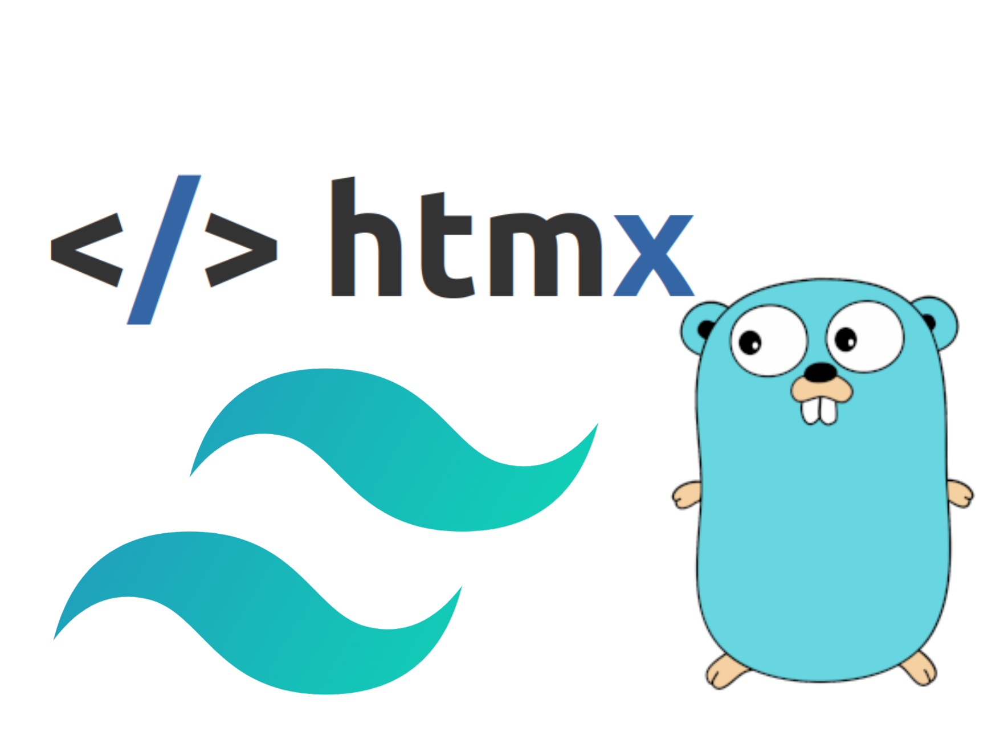
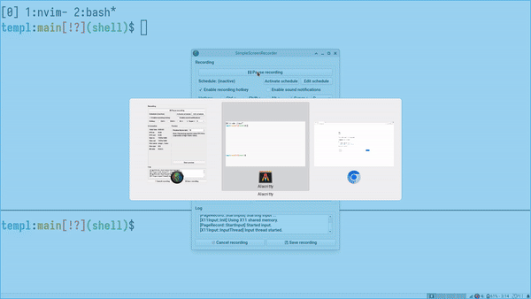
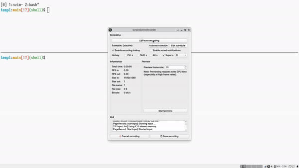

The goal of this article is to set up a project template with the
following features:

- Set up TEMPL
- Set up Tailwind CSS
- Set up HTMX
- Automatically rebuild CSS (Tailwind)
- Live reload Go application on change using Air

This article assumes that you have Go, TEMPL, npm, and Air installed in
your PATH.

Our project structure will look like this at the end of this article:

```plaintext
.
├── go.mod
├── go.sum
├── main.go
├── package.json
├── package-lock.json
├── static
│   └── css
│       └── tailwind.css
├── tailwind.config.js
└── view
    ├── index.templ
    ├── index_templ.go
    ├── layout
    │   ├── base.templ
    │   └── base_templ.go
    └── partial
        ├── foo.templ
        └── foo_templ.go
```

## Setup TEMPL

```
go get github.com/a-h/templ
```

```go
// file: view/index.templ
package view

templ Index() {
	<header>
		<h1 class="text-center text-3xl font-bold">
			Hello, World
		</h1>
	</header>
	<div class="flex justify-center mt-10">
		<!-- HTMX here -->
		<button hx-get="/foo" class="btn bg-teal-200 p-4 rounded-lg">
			FOO
		</button>
	</div>
}
```

As you can see, in the `index.templ` file, we have used Tailwind classes
and HTMX's `hx-get` attribute. When the user clicks on the button, `FOO`
should be replaced by `BAR`. The foo template is as follows,

```go
// file: view/partial/foo.templ
package partial

templ Foo() {
	<h2 class="text-red-500 font-bold text-xl">
		BAR
	</h2>
}
```

Now, let's create a base layout that wraps the index page.

```go
// file: view/layout/base.templ
package layout

templ Base(children ...templ.Component) {
	<!DOCTYPE html>
	<html lang="en">
		<head>
			<meta charset="UTF-8"/>
			<meta name="viewport" content="width=device-width, initial-scale=1.0"/>
			<title>Hello, TEMPL</title>
			<!-- tailwind css -->
			<link href="/static/css/tailwind.css" rel="stylesheet"/>
		</head>
		<body>
			for _, child := range children {
				@child
			}
			<!-- htmx -->
			<script src="https://unpkg.com/htmx.org@1.9.10"></script>
		</body>
	</html>
}
```

The base template takes in a variadic argument of children components
that can be rendered inside it. It also includes the built tailwind
stylesheet (we'll come back to this later) as well as imports HTMX.

Now that all our templates are in place, let's generate the
corresponding `go` file:

```
templ generate
```

Finally, let's stitch everything together.

```go
// file: main.go
package main

import (
	"log"
	"net/http"

	"github.com/murtaza-u/mytempl/view"
	"github.com/murtaza-u/mytempl/view/layout"
	"github.com/murtaza-u/mytempl/view/partial"

	"github.com/a-h/templ"
)

func main() {
	fs := http.FileServer(http.Dir("./static"))
	http.Handle("/static/", http.StripPrefix("/static/", fs))

	c := layout.Base(view.Index())
	http.Handle("/", templ.Handler(c))

	http.Handle("/foo", templ.Handler(partial.Foo()))

	log.Fatal(http.ListenAndServe(":8080", nil))
}
```

In addition to the template routes, we also need to create a file server
to serve the Tailwind CSS stylesheet and other static assets (in the
future).

## Setup Tailwind CSS

In order to set up Tailwind, we need to initialize a node module:

```
npm init -y
```

Next, initialize Tailwind CSS,

```plaintext
npm install -D tailwindcss
npx tailwindcss init
```

Edit the generated `tailwind.config.js`:

```js
/** @type {import('tailwindcss').Config} */
export default {
  content: ["./view/**/*.templ"], // this is where our templates are located
  theme: {
    extend: {},
  },
  plugins: [],
}
```

The `content` field is very important. It asks Tailwind to watch over
all the files ending with `.templ` inside the `view` directory.

Next, add two convenience scripts to `package.json`:

```json
"scripts": {
  "build": "tailwindcss build -o static/css/tailwind.css --minify",
  "watch": "tailwindcss build -o static/css/tailwind.css --watch"
}
```

The `build` script compiles Tailwind CSS stylesheet for production, and
the `watch` script watches over changes to the content directory
(`view/**/*.templ`) we configured above and automatically recompiles the
stylesheet.

File: `package.json`

```json
{
  "name": "mytempl",
  "private": true,
  "version": "1.0.0",
  "type": "module",
  "scripts": {
    "build": "tailwindcss build -o static/css/tailwind.css --minify",
    "watch": "tailwindcss build -o static/css/tailwind.css --watch"
  },
  "devDependencies": {
    "tailwindcss": "^3.4.1"
  }
}
```

## Result



We have successfully set up a project with TEMPL, HTMX, and Tailwind CSS
and configured Tailwind to automatically rebuild the stylesheet.
However, there is one inconvenience that we still have to face during
development - we need to restart the Go app every time we make a change
to our project. Let's fix that.

## Air

Moving on to the final piece of the article, Air is a program that
allows us to live reload the Go app. To set it up with TEMPL, we need to
create a `.air.toml` file in the root of the project.

```toml
# file: .air.toml

root = "."
tmp_dir = "bin"

[build]
  bin = "./bin/main"
  cmd = "templ generate && go build -o ./bin/main ."
  delay = 1000
  exclude_dir = ["static", "node_modules"]
  exclude_regex = [".*_templ.go"]
  exclude_unchanged = false
  follow_symlink = false
  include_ext = ["go", "tpl", "tmpl", "templ", "html"]
  kill_delay = "0s"
  log = "build-errors.log"
  send_interrupt = false
  stop_on_error = true

[color]
  build = "yellow"
  main = "magenta"
  runner = "green"
  watcher = "cyan"

[log]
  time = false

[misc]
  clean_on_exit = true
```

To run Air, all you need to do is type `air`. Air will automatically
pick up the `toml` file and run the Go app.

```plaintext
air
```

## Ending


